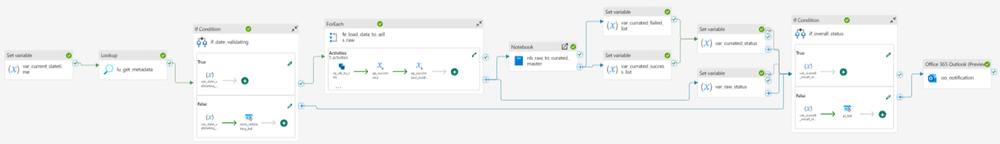
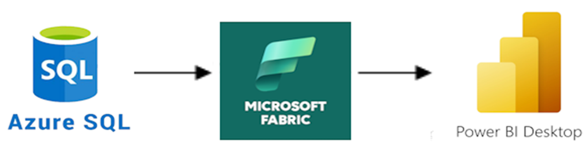

# Hi, my name is Lolita Mechkauskaite
# 💼 I`m Junior Data Analyst 

---
### Find me

---

## 🧠 Summary
Detail-oriented **Junior Data Analyst** with a strong foundation in SQL, data visualization, and ETL/ELT processes.  
Experienced in preparing, transforming, and validating analytical datasets.  
Skilled in using cloud technologies and BI tools to build transparent and efficient data pipelines.

---

## 🧰 Technical Skills
| Category | Skills |
|----------|--------|
| **Languages & Tools** | SQL, Python, DAX, Power BI, Tableau, Excel, Google Sheets |
| **Cloud & ETL** | Azure Data Factory, Microsoft Fabric, Azure SQL Database |
| **Data** | Data Cleaning, Transformation, Quality Control, Modeling, Visualization |
| **Other** | Git, Agile/Kanban, Confluence, JIRA |

---

## 🧪 Projects

### 📊 Northwind 2025 — Final Lab Project (EPAM)
- Designed and implemented an **end-to-end ELT workflow** in Microsoft Fabric.  
- Built parameterized **data pipelines and notebooks** for automated ingestion from Azure SQL to Lakehouse.  
- Implemented **load monitoring** using SQL-based logging and validation.  
- Developed **incremental and full load** logic.  
- Presented the solution during the final project defense as team speaker.

  ##The pipeline schema  | ## Dataflow 

**Tech stack:** `Azure Data Factory`, `Microsoft Fabric`, `Delta Lake`, `SQL`, `Power BI`, `Python`

---

## 🧭 Professional Experience

### 📊 Product Data Analyst — Ciklum
- Worked on product data quality assurance and reporting.  
- Validated large datasets and contributed to improving data accuracy.  
- Collaborated with cross-functional teams in an Agile environment.

**Tech stack:** `SQL`, `Excel`, `Power BI`, `Confluence`, `JIRA`

---

## 🎓 Education & Courses
| 📘 | |
|-----|---|
| EPAM Data & Analytics Lab | Data Engineering / Analytics track |
| Bachelor's degree | Quantitative field |
| Additional learning | Python, A/B testing, statistics |

---

## 🌱 Other Interests
- Game development (Unity)  
- Watercolor painting  
- D&D campaigns  
- Data storytelling & visualization

